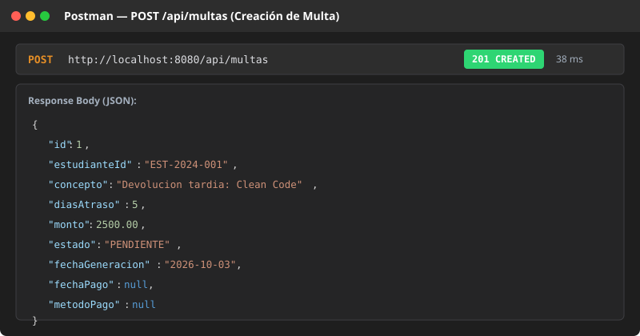
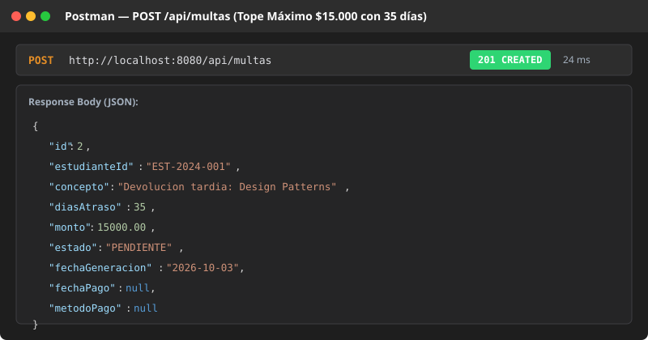
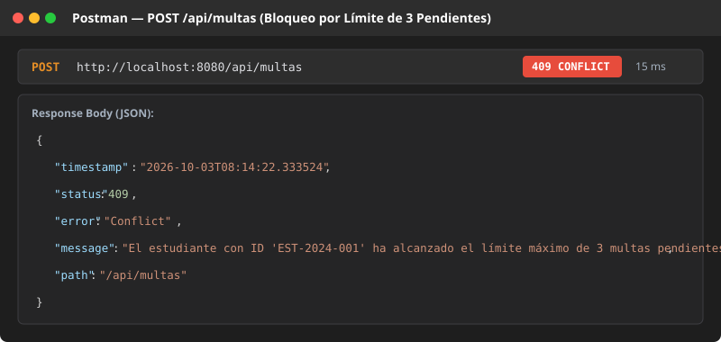
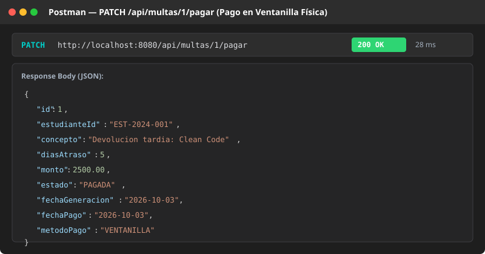
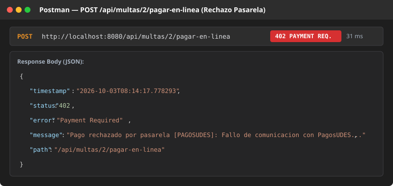
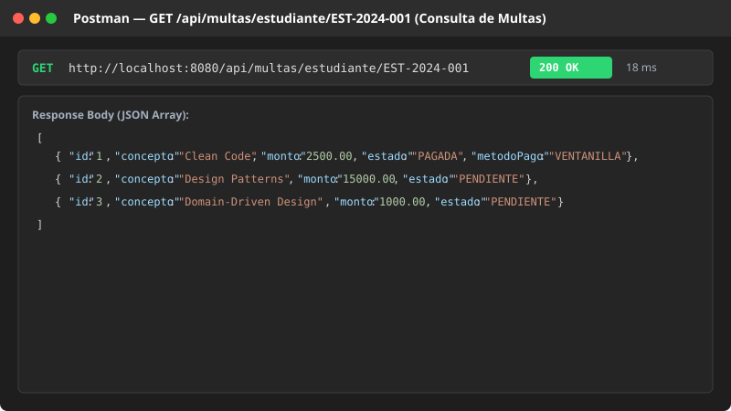

# Post-contenido — Unidad 7: Patrones Arquitectónicos I (Sistema de Multas de Biblioteca)

**Autor:** Rodríguez  
**Tecnologías:** Java 17 | Spring Boot 3.2.3 | Spring Data JPA | H2 Database | Jakarta Validation | Maven | JUnit 5 & Mockito

---

## 1. Descripción General del Proyecto

El proyecto **`multas-biblioteca-api`** implementa el sistema de gestión y liquidación de sanciones por devolución tardía de material bibliográfico en una institución universitaria. La solución aborda desde el diseño de una arquitectura en capas tradicional limpia y con modelo de dominio rico (Parte 1), hasta la evolución hacia una arquitectura de Puertos y Adaptadores (Arquitectura Hexagonal / Opción C) para el procesamiento desacoplado de pagos en línea con múltiples proveedores (Parte 2: PagosUDES y Wompi).

---

## 2. Diagrama de Arquitectura y Estructura de Paquetes

### 2.1 Diagrama Textual de Arquitectura

```
                              [ CLIENTES HTTP / CONSUMIDORES REST ]
                                                │
                                                ▼
┌─────────────────────────────────────────────────────────────────────────────────────────────┐
│ Capa de Presentación (REST API)                                                            │
│ ├─ MultaController (GET / POST / PATCH /api/multas)                                         │
│ ├─ GenerarMultaRequest (DTO de entrada con validaciones @Valid)                              │
│ └─ GlobalExceptionHandler (@RestControllerAdvice: 400, 402, 404, 409)                       │
└───────────────────────────────────────┬─────────────────────────────────────────────────────┘
                                        │
                                        ▼
┌─────────────────────────────────────────────────────────────────────────────────────────────┐
│ Capa de Aplicación / Servicios                                                              │
│ └─ MultaService (@Service, @Transactional)                                                  │
│      ├── Genera multas validando tope de 3 pendientes                                       │
│      ├── Procesa pago en ventanilla física                                                  │
│      └── Orquesta pago en línea invocando el puerto de dominio PasarelaPagoPort              │
└──────────────────────┬───────────────────────────────────────────────┬──────────────────────┘
                       │                                               │
                       ▼                                               ▼
┌──────────────────────────────────────────────┐ ┌────────────────────────────────────────────┐
│ Capa de Persistencia (Spring Data JPA)       │ │ Capa de Dominio Puro (Core de Negocio)      │
│ └─ MultaRepository                           │ │ ├─ Multa (Entidad @Entity, Modelo Rico)    │
│      ├── findByEstudianteId(id)              │ │ ├─ EstadoMulta (Enum: PENDIENTE, PAGADA)   │
│      └── countByEstudianteIdAndEstado(...)   │ │ ├─ Excepciones: NotFound, Limite, YaPagada  │
│          (Conteo delegado a SQL O(1))        │ │ ├─ domain.ResultadoPago (Record Neutral)   │
│                                              │ │ ├─ domain.PagoRechazadoException           │
│                                              │ │ └─ domain.port.PasarelaPagoPort (Interfaz) │
└──────────────────────┬───────────────────────┘ └─────────────────────▲──────────────────────┘
                       │                                               │ (Inversión de Dependencias)
                       ▼                                               │
               ┌───────────────┐                 ┌─────────────────────┴──────────────────────┐
               │ Base de Datos │                 │ Capa de Infraestructura (Adaptadores)      │
               │   H2 en Memoria│                │ ├─ RestTemplateConfig (Bean RestTemplate)  │
               └───────────────┘                 │ ├─ PagosUdesAdapter (app.pagos=pagosudes)  │
                                                 │ └─ WompiAdapter (app.pagos=wompi)          │
                                                 └────────────────────────────────────────────┘
```

### 2.2 Estructura Final del Proyecto

```
rodriguez-post1-u7/
├── README.md
└── multas-biblioteca-api/
    ├── pom.xml
    └── src/
        ├── main/
        │   ├── java/com/example/multas/
        │   │   ├── MultasApplication.java
        │   │   ├── controller/
        │   │   │   ├── GenerarMultaRequest.java
        │   │   │   ├── GlobalExceptionHandler.java
        │   │   │   └── MultaController.java
        │   │   ├── domain/
        │   │   │   ├── PagoRechazadoException.java
        │   │   │   ├── ResultadoPago.java
        │   │   │   └── port/
        │   │   │       └── PasarelaPagoPort.java
        │   │   ├── infrastructure/
        │   │   │   ├── config/
        │   │   │   │   └── RestTemplateConfig.java
        │   │   │   └── pago/
        │   │   │       ├── PagosUdesAdapter.java
        │   │   │       └── WompiAdapter.java
        │   │   ├── model/
        │   │   │   ├── EstadoMulta.java
        │   │   │   ├── LimiteMultasPendientesException.java
        │   │   │   ├── Multa.java
        │   │   │   ├── MultaNotFoundException.java
        │   │   │   └── MultaYaPagadaException.java
        │   │   ├── repository/
        │   │   │   └── MultaRepository.java
        │   │   └── service/
        │   │       └── MultaService.java
        │   └── resources/
        │       └── application.properties
        └── test/
            └── java/com/example/multas/
                ├── controller/
                │   └── MultaControllerTest.java
                ├── integration/
                │   └── PasarelaPagoIntegrationTest.java
                └── service/
                    └── MultaServiceTest.java
```

---

## 3. Instrucciones de Compilación, Pruebas y Ejecución

### 3.1 Requisitos Previos
* **Java Development Kit (JDK):** Versión 17 o superior.
* **Apache Maven:** Versión 3.8 o superior.

### 3.2 Ejecución de la Suite de Pruebas Automatizadas
Para ejecutar las pruebas unitarias y de integración:
```bash
cd multas-biblioteca-api
mvn clean test
```

### 3.3 Ejecución del Servidor de Aplicación
Para iniciar el servidor en el puerto local `8080`:
```bash
cd multas-biblioteca-api
mvn spring-boot:run
```

* **Consola Web H2:** `http://localhost:8080/h2-console`
  * **JDBC URL:** `jdbc:h2:mem:multas_biblioteca_db`
  * **Usuario:** `sa`
  * **Contraseña:** *(vacía)*

### 3.4 Resumen de Endpoints REST

| Método | Endpoint | Descripción | Respuestas HTTP |
| :--- | :--- | :--- | :--- |
| `GET` | `/api/multas` | Lista todas las multas registradas | `200 OK` |
| `GET` | `/api/multas/{id}` | Consulta una multa específica por ID | `200 OK`, `404 Not Found` |
| `GET` | `/api/multas/estudiante/{estudianteId}` | Consulta las multas de un estudiante | `200 OK` |
| `POST` | `/api/multas` | Genera una nueva multa | `201 Created`, `400 Bad Request`, `409 Conflict` |
| `PATCH` | `/api/multas/{id}/pagar` | Paga la multa en ventanilla física | `200 OK`, `404 Not Found`, `409 Conflict` |
| `POST` | `/api/multas/{id}/pagar-en-linea` | Procesa el pago con la pasarela activa | `200 OK`, `402 Payment Required`, `404`, `409` |

### 3.5 Evidencia Visual de Endpoints Probados (Capturas Postman / cURL)

La evidencia detallada con todas las solicitudes y respuestas JSON se encuentra documentada en [docs/pruebas-endpoints.md](docs/pruebas-endpoints.md). A continuación, se presentan las capturas de los casos de uso críticos:

#### 1. Creación de Multa con Cálculo Ordinario (201 Created)


#### 2. Aplicación de Regla de Tope Máximo $15.000 (201 Created)


#### 3. Bloqueo al Superar Límite de 3 Multas Pendientes (409 Conflict)


#### 4. Pago en Ventanilla Física (200 OK)


#### 5. Pago en Línea con Rechazo de Pasarela (402 Payment Required)


#### 6. Consulta de Multas por Estudiante (200 OK)


---

## 4. Justificación Exhaustiva de los 4 Puntos de Decisión de Diseño

### Punto 1: Cálculo del Monto en la Entidad vs. Service (Modelo Rico vs. Modelo Anémico)
* **Decisión:** La lógica de liquidación monetaria se implementó como un método estático de dominio en `Multa.calcularMonto(int diasAtraso)` con las constantes de negocio `VALOR_POR_DIA = $500` y `TOPE_MAXIMO = $15.000`, mientras que la mutación de estado reside en `multa.marcarComoPagada(metodoPago)`.
* **Justificación:** 
  1. **Prevención del Antipatrón de Modelo Anémico (*Anemic Domain Model*):** Si las entidades JPA se reducen a meras bolsas de datos con *getters* y *setters*, y toda la lógica matemática y de validación de invariantes se traslada al `MultaService`, se viola el principio fundamental de la programación orientada a objetos (cohesión de datos y comportamiento).
  2. **Independencia de Dependencias:** El cálculo del monto de una multa no requiere llamadas a bases de datos, APIs de terceros ni servicios externos; depende única y exclusivamente de los días de mora. Al ubicarla en `Multa`, la regla es determinista, fácilmente testeable de forma unitaria y reutilizable en cualquier contexto sin instanciar componentes de Spring.

### Punto 2: Conteo de Multas Pendientes (SQL vs. Memoria con Streams)
* **Decisión:** Se definió `countByEstudianteIdAndEstado(String estudianteId, EstadoMulta estado)` en `MultaRepository` delegando la operación directamente al motor de base de datos relacional mediante la cláusula `SELECT COUNT(*)`.
* **Justificación:**
  1. **Complejidad y Rendimiento ($O(1)$ vs. $O(N)$):** Al delegar el conteo a la base de datos, el costo de transferencia de datos a través de la red y JDBC es $O(1)$ (un solo valor escalar entero/long). Si se hubiese traído la lista completa de multas del estudiante (`findByEstudianteId`) a la memoria de la JVM para filtrar con Java Streams (`filter(m -> m.getEstado() == PENDIENTE).count()`), la complejidad de transferencia, consumo de memoria *Heap* y deserialización Hibernate crecería a $O(N)$.
  2. **Escalabilidad y Bloqueo Concurrente:** En una universidad con cientos de miles de préstamos históricos acumulados por estudiante a lo largo de su carrera, cargar todas las multas históricas pagadas en memoria para solo verificar si tiene 3 pendientes provocaría degradación severa de latencia y recolección de basura (*Garbage Collection*).

### Punto 3: Selección del Adaptador Activo (`@ConditionalOnProperty` vs. `Map` Dinámico)
* **Decisión:** Se utilizó la anotación `@ConditionalOnProperty(prefix = "app.pagos", name = "proveedor", havingValue = "...", matchIfMissing = ...)` para instanciar en tiempo de arranque (*startup time*) únicamente el adaptador requerido (`PagosUdesAdapter` o `WompiAdapter`).
* **Justificación:**
  1. **Alineación con el Requisito del Negocio:** En el contexto de la institución, la pasarela de pago está determinada por la sede o la configuración de infraestructura del despliegue (durante la fase piloto, una sede opera con PagosUDES y otra con Wompi), no por una elección del estudiante en cada transacción individual.
  2. **Principio *Fail-Fast* y Eficiencia de Recursos:** La validación condicional en arranque asegura que si la configuración de la pasarela es errónea o faltan propiedades, el contenedor de Spring falla de inmediato al iniciar. Además, evita registrar beans innecesarios en el ApplicationContext, reduciendo la superficie de memoria y eliminando lógica condicional o *switch-cases* en tiempo de ejecución.

### Punto 4: Diseño del Puerto de Dominio y Modelo Neutral
* **Decisión:** El contrato `PasarelaPagoPort` y el record `ResultadoPago` residen en el paquete `com.example.multas.domain` con **cero dependencias e imports de Spring Framework, Jakarta EE o librerías HTTP**.
* **Justificación:**
  1. **Cumplimiento del Principio de Inversión de Dependencias (DIP):** Los módulos de alto nivel (como las reglas de negocio en `MultaService`) no dependen de los módulos de bajo nivel (los adaptadores HTTP `PagosUdesAdapter` y `WompiAdapter`); ambos dependen de la abstracción pura `PasarelaPagoPort`.
  2. **Inmunidad al Acoplamiento Tecnológico:** Wompi maneja montos en centavos (`amount_in_cents`), códigos de referencia y estados (`APPROVED`), mientras que PagosUDES maneja `idTransaccion`, `codigoEstudiante` y `estadoTransaccion`. `ResultadoPago` unifica estas respuestas en un modelo canónico neutral (`proveedor`, `exitoso`, `referenciaExterna`, `mensaje`). De esta forma, si una pasarela externa cambia su API o introduce nuevos campos JSON, los adaptadores absorben la traducción y el núcleo del dominio permanece 100% intacto.

---

## 5. Trade-off Considerado (Parte 2: Opción B vs. Opción C)

| Criterio de Evaluación | Opción B (Patrón Strategy en `service/`) | Opción C (Puertos y Adaptadores en `domain/` e `infrastructure/`) [ELEGIDA] |
| :--- | :--- | :--- |
| **Aislamiento del Dominio** | **Medio / Bajo:** La interfaz de la estrategia suele residir en el mismo paquete que los servicios y tiende a acoplarse a DTOs del framework. | **Óptimo:** Aislamiento absoluto. El paquete `domain` no tiene dependencias de Spring ni de protocolos de red. |
| **Cumplimiento de DIP (SOLID)** | **Parcial:** El servicio depende de una abstracción local, pero los adaptadores suelen residir en el mismo nivel de visibilidad. | **Estricto:** El dominio define el puerto y la infraestructura implementa el adaptador de afuera hacia adentro. |
| **Complejidad y Número de Archivos** | **Baja:** Menos paquetes y clases. Adecuado para MVPs o aplicaciones monolíticas pequeñas. | **Moderada:** Requiere estructuración formal en carpetas (`domain/port`, `infrastructure/pago`, `infrastructure/config`), records neutrales y adaptadores dedicados. |
| **Mantenibilidad y Extensibilidad** | **Aceptable:** Modificaciones en proveedores externos pueden filtrar cambios a la capa de servicio. | **Excelente:** Incorporar una nueva pasarela (e.g. PSE, Stripe, PayU) solo requiere un nuevo adaptador `@Component` sin tocar el servicio ni la base de datos. |
| **Facilidad de Pruebas Unitarias** | **Buena:** Permite burlar la interfaz Strategy. | **Sobresaliente:** El dominio se prueba de manera determinista y pura; los adaptadores se prueban con `MockRestServiceServer` o mocks de `RestTemplate`. |

**Conclusión del Trade-off:** Se seleccionó la **Opción C** porque, a pesar del costo inicial de crear más paquetes y clases de traducción, garantiza la longevidad del sistema, la portabilidad del modelo de negocio y una separación estricta de responsabilidades acorde a las mejores prácticas de arquitectura de software empresarial.

---

## 6. Conclusiones Profesionales

1. **Arquitectura Limpia y Modular:** La transición de un modelo en capas básico a una arquitectura con puertos y adaptadores permite que el sistema de multas de la biblioteca crezca de forma ordenada, aislando las políticas de negocio de los detalles de infraestructura volátiles (como APIs de pagos y bases de datos).
2. **Robustez y Resiliencia en Pagos:** La encapsulación de errores de comunicación HTTP en `ResultadoPago` y su posterior traducción a `PagoRechazadoException` asegura que las fallas transaccionales de terceros no dejen multas en estados inconsistentes en la base de datos institucional.
3. **Mapeo Semántico HTTP:** El uso de un manejador de excepciones global (`GlobalExceptionHandler`) desacopla las excepciones de negocio de la respuesta HTTP, garantizando respuestas REST uniformes y códigos de estado semánticos apropiados (`200`, `201`, `400`, `402`, `404`, `409`).
4. **Calidad Respaldada por Pruebas:** Con 28 casos de prueba automatizados entre pruebas unitarias (`MultaServiceTest`), de capa web (`MultaControllerTest`) y de integración de contexto (`PasarelaPagoIntegrationTest`), se asegura una cobertura exhaustiva de todas las reglas de negocio, validaciones y ramas de ejecución.